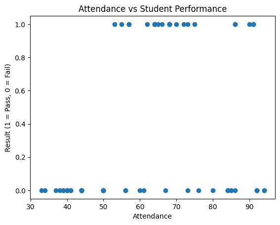

# Student Performance Prediction System

## Project Overview
This project focuses on predicting student academic performance (Pass/Fail) using Machine Learning techniques.  
The system is implemented using Python in Google Colab and applies Logistic Regression for classification.

## Problem Statement
Identifying students at academic risk early can help institutions provide timely support.  
This project aims to predict whether a student will pass or fail based on academic indicators such as attendance, internal marks, and assignment scores.

## Dataset Creation & Preprocessing
Due to privacy concerns with real student data, a synthetic dataset was created for learning and demonstration purposes.

### Features Used
- Attendance (%)
- Internal Marks
- Assignment Score
- Result (Target Variable: 1 = Pass, 0 = Fail)

### Labeling Logic
- Internal marks were treated as the dominant factor.
- Students with very low internal marks were labeled as Fail, even if attendance or assignment scores were high.
- Students with average or high internal marks and at least one additional supporting factor were labeled as Pass.
- This rule-based labeling ensured consistency for supervised learning.

### Data Separation
The dataset was split into training and testing sets to evaluate model performance on unseen data.

## Model Used
- Algorithm: Logistic Regression
- Type: Supervised Machine Learning (Classification)
- The model learns the relationship between academic features and student outcomes.

## Implementation Tools
- Python
- Google Colab
- NumPy
- Pandas
- Matplotlib
- Scikit-learn

## How it works
1. Dataset creation (60 students with attendance, marks, and assignment scores)
2. Data preprocessing (convert Pass/Fail to numbers)
3. Model training using Logistic Regression
4. Prediction on new data
5. Accuracy evaluation
6. Graph visualization (Attendance vs Result)

## Files
- `Student_Performance_Prediction.ipynb` — Notebook containing the code
- `StudentDataset.csv` — Dataset used for training

## Outcome
- Achieved around 94.44% prediction accuracy
- Provides early identification of students who may need academic support

# Student-Performance-Prediction
AI project predicting student performance using Python &amp; Logistic Regression
